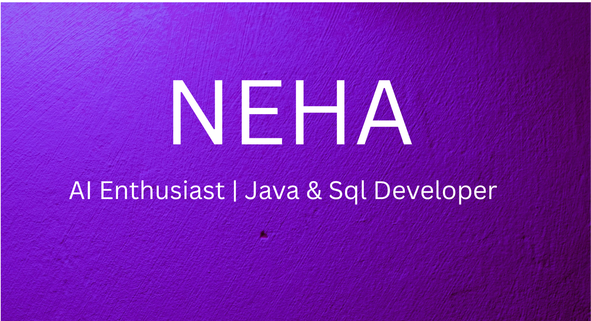

<!-- Banner -->

  

<h1 align="center">👋 Hi, I'm Neha Kumari</h1>

  <b>Java & SQL Developer</b> • 
  <b>AI & LLM Enthusiast</b> • 
  <b>Automation Builder | n8n</b>

---

### 👩‍💻 About Me

I completed my **B.Tech in Information Science & Engineering (2024)** from CMR Institute of Technology.  
I build efficient backend logic, automate real-world workflows, and explore AI tools to create smart solutions.  

I enjoy writing clean code, learning new technologies, and contributing to impactful projects. 🚀

---

### 🛠 Tech Skills

**Programming:**  
`Java (Core & Advanced)` · `JavaScript`

**Backend & APIs:**  
`JDBC` · `REST APIs` · `Hibernate`

**Databases:**  
`SQL` · `MySQL` · `Oracle` · `PL/SQL`

**Frontend:**  
`HTML` · `CSS` · `Responsive Layouts (Flexbox & Grid)`

**Developer Tools:**  
`Git` · `GitHub` · `VS Code` · `Eclipse`

**AI Tools:**  
`ChatGPT` · `VS Code Copilot` · `n8n`

---

### 🚀 Featured Projects

🔹 **LinkedIn Job Automation | n8n, OpenAI, Google Sheets**  
Automated job listings → Skill extraction → Logging insights to Google Sheets.

🔹 **Hotel Management System | HTML, CSS, MySQL**  
Room booking & real-time room availability management.

🔹 **BMW Website Clone | HTML, CSS**  
Fully responsive static clone — UI/UX and layout enhancement.

🔹 **Play The Guess Game | Java, Hibernate, JDBC**  
User account system with deposit logic and DB-based scores.

📌 Explore pinned repositories for more!

---

### 📚 Currently Learning

- Database Optimization & SQL Best Practices  
- AI + Automation Workflows (n8n)  
- Backend architecture patterns

---

### ⚡ GitHub Stats

  
  

---

### 🌍 Connect With Me

📧 Email: **neku2604@gmail.com**  
🔗 LinkedIn: www.linkedin.com/in/neha-kumari-7254922b9  

---

✨ Thanks for visiting my profile! Drop a ⭐ on any project you like ✨

